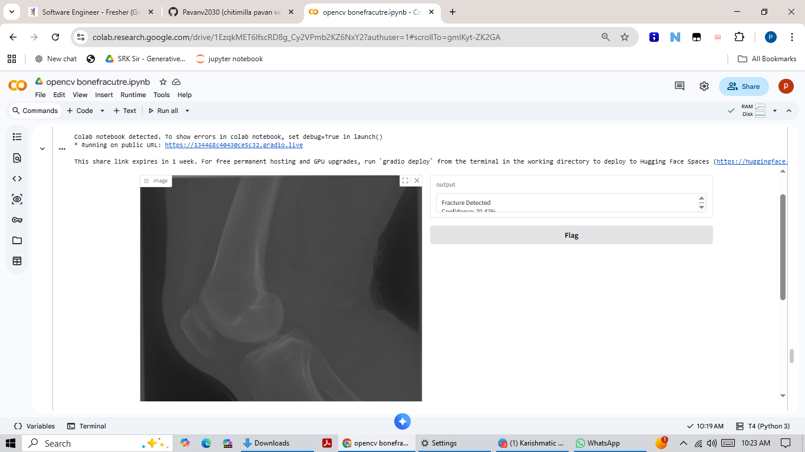
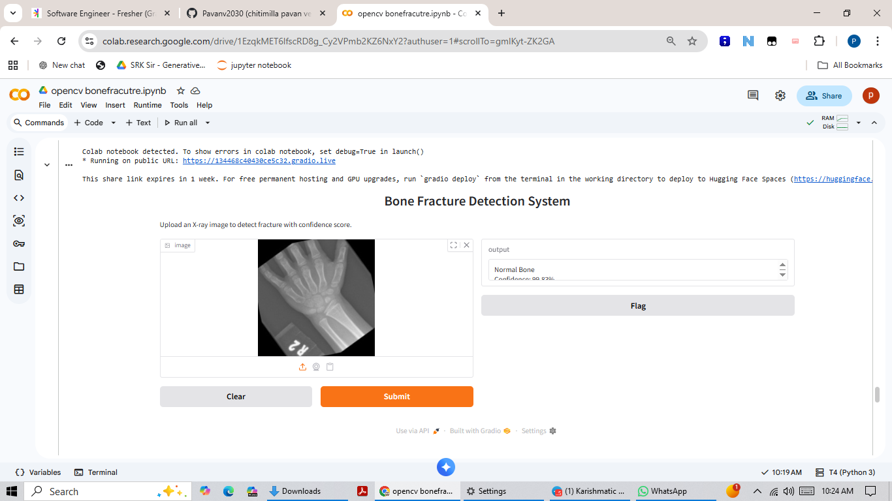

# X-Ray Bone Fracture Detection Using CNN and OpenCV


> **An AI-powered real-time bone fracture detection system that helps patients and clinicians get instant analysis of X-ray images — reducing dependency on immediate radiologist availability.**

---

## 📸 Live Demo

<table>
  <tr>
    <td align="center"><b>🔴 Fracture Detected (Confidence: 70.47%)</b></td>
    <td align="center"><b>✅ Normal Bone (Confidence: 99.83%)</b></td>
  </tr>
  <tr>
    <td></td>
    <td></td>
  </tr>
</table>

---

## Problem Statement

Every day, thousands of patients receive X-ray reports they cannot understand. In under-resourced clinics and emergency settings:

- Radiologists are overloaded with scan backlogs
- Patients wait hours for basic fracture confirmation
- Common people cannot interpret their own X-ray scans
- Rural areas often lack immediate specialist access

**This system provides an instant, reliable assistive tool — not to replace doctors, but to empower faster triage and patient awareness.**

---

## Model Performance

| Metric | Score |
|--------|-------|
| **Accuracy** | **97%** |
| **F1 Score** | **95%** |
| Training Images | 8,800+ |
| Test Samples | 506 |
| Classes | Fractured / Normal |

### Confusion Matrix

<p align="center">
  
</p>

| | Predicted Normal (0) | Predicted Fractured (1) |
|---|:---:|:---:|
| **Actual Normal (0)** |237 | 1 |
| **Actual Fractured (1)** | 11 |  257 |

- **True Positives: 257** — fractures correctly identified
- **True Negatives: 237** — normal bones correctly identified
- **False Negatives: 11** — missed fractures (closely monitored)
- **False Positives: 1** — near-zero unnecessary alarms

> **Why F1 Score matters more than Accuracy in Medical AI:**
> A false negative (missing a real fracture) is far more dangerous than a false alarm.
> F1 Score validates performance equally across both classes — making it the critical metric for healthcare applications.

---

## CNN Architecture

```
Input Layer      →  X-Ray Image (150 × 150 × 3)
                         ↓
Conv2D (32)      →  ReLU Activation
MaxPooling2D     →  2×2 Pool Size
                         ↓
Conv2D (64)      →  ReLU Activation
MaxPooling2D     →  2×2 Pool Size
                         ↓
Conv2D (128)     →  ReLU Activation
                         ↓
Flatten          →  3D → 1D Array
Dense (128)      →  ReLU + Dropout
                         ↓
Output Layer     →  Dense(2) + Softmax
                  [P(Normal), P(Fractured)]
```

**Architecture reasoning:**
- Progressive filter increase (32→64→128) captures features from edges to complex fracture patterns
- MaxPooling reduces spatial dimensions while preserving critical structural patterns
- Dropout prevents overfitting on medical imaging data
- Softmax outputs probability distribution — enabling confidence scoring per prediction

---

##Overfitting Prevention Strategy

| Technique | Purpose |
|-----------|---------|
| **Dropout Layers** | Randomly deactivates neurons during training to prevent co-dependency |
| **ReduceLROnPlateau** | Reduces learning rate when validation loss stops improving |
| **Data Augmentation** | Rotation, flip, zoom on training images for generalization |
| **Balanced Dataset** | 50/50 split — equal fractured vs normal image representation |

---

## Dataset

- **Total Images:** 8,800+ X-ray scans
- **Classes:** Fractured / Normal — balanced 50/50
- **Preprocessing:** Resize 150×150, Normalization, Augmentation
- **Split:** Training / Validation / Test sets

---

## Tech Stack

| Technology | Usage |
|------------|-------|
| Python 3.8+ | Core language |
| TensorFlow / Keras | Model building & training |
| OpenCV | Image preprocessing & live camera feed |
| Gradio | Web UI deployment |
| NumPy / Matplotlib | Data processing & visualization |
| Google Colab (T4 GPU) | Training environment |

---

## How to Run Locally

### 1. Clone the repository
```bash
git clone https://github.com/Pavanv2030/X-Ray-Bone-Fracture-Detection-Using-CNN-and-OpenCV.git
cd X-Ray-Bone-Fracture-Detection-Using-CNN-and-OpenCV
```

### 2. Install dependencies
```bash
pip install -r requirements.txt
```

### 3. Download the trained model
Download and place in the root directory:

[Download Model from Google Drive](https://drive.google.com/file/d/1zsrpa9R8g0_fiPf1qAdFXh8I9uUSHU2J/view?usp=drive_link)

### 4. Run the notebook
```bash
jupyter notebook bone_fracture_detection.ipynb
```

### 5. Launch Gradio UI
The Gradio interface launches automatically at the end of the notebook.
Upload any X-ray image to get an instant prediction with confidence score.

---

## Project Structure

```
X-Ray-Bone-Fracture-Detection/
│
├── bone_fracture_detection.ipynb   # Main training & inference notebook
├── requirements.txt                # All dependencies
├── screenshots/
│   ├── confusion_matrix.png        # Model evaluation results
│   ├── gradio1.png                 # Fracture detected demo
│   └── gradio2.png                 # Normal bone demo
└── README.md
```

---

## Key Learnings

- **Business problem first** — started from patient pain points, not technology
- **F1 Score > Accuracy** in medical and imbalanced datasets
- **Deployment is where real learning happens** — Gradio made it accessible to non-technical users
- **Confidence scoring** builds user trust beyond binary predictions
- **Medical AI needs responsibility** — always communicate model limitations clearly

---

## Future Roadmap

- [ ] **Grad-CAM** visualization — highlight exact fracture region on X-ray for explainability
- [ ] **Pediatric dataset** — extend model to children's bone structure
- [ ] **Hugging Face Spaces** — permanent free deployment
- [ ] **Multi-class detection** — identify fracture type and anatomical location
- [ ] **SHAP / LIME** — model interpretability for clinical trust building

---

## Medical Disclaimer

> This tool is an **AI-assisted system** designed to support — not replace — qualified medical professionals.
> All predictions must be reviewed by a licensed radiologist before any clinical decision is made.

---

## Author

**Chitimilla Pavan Venkat**

[](https://github.com/Pavanv2030)
[](https://linkedin.com/in/pavan-venkat-s)

<p align="center">
   <b>If this project helped you or inspired you, please give it a star!</b><br/>
  It helps others discover this work and motivates continued improvement.
</p>
